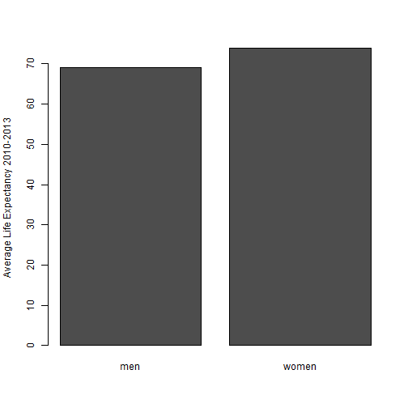

Death Year Prediction tool
========================================================
author: Michael Kobiliansky
date: October 2014
transition: rotate

Tool description
========================================================

The Death Year Prediction is a rather simple tool, really.
It needs a user input of:

- Birth Year
- Gender

Then the tool presents the user with an estimate of a death year for the input.

***

Tool description (cont.)
========================================================

The Death Year calculation is based on the average world life expectancy for 2010-2013.
In that time period the average life expectancy for men has been 69 years, while the women around the globe had average life expectancy of 74 years (rounded up).

***

 

Example
========================================================

So, if someone were to provide the following input:

***

...he would get the following output:

========================================================

